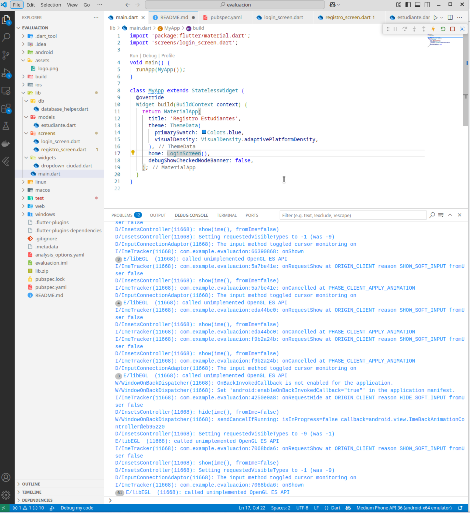
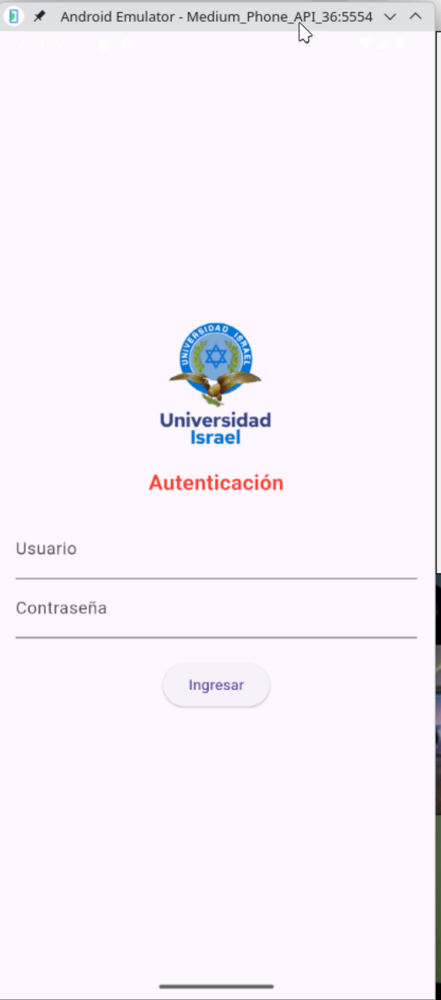
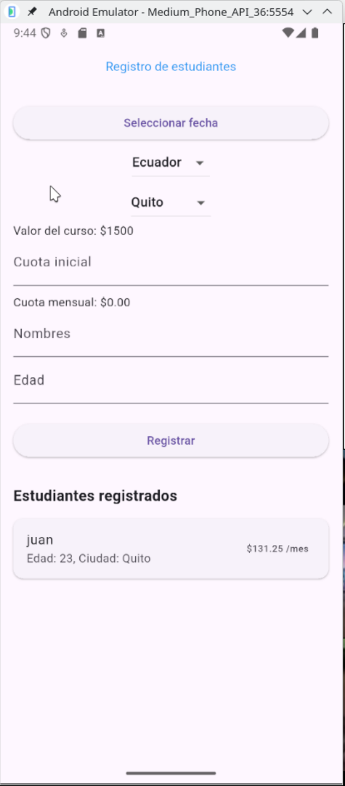
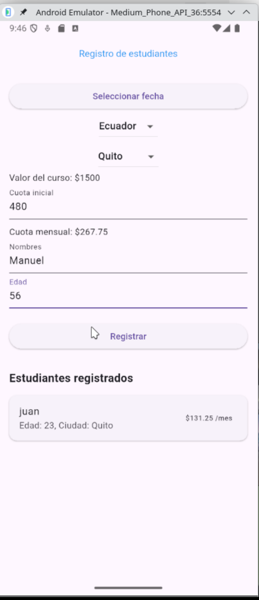
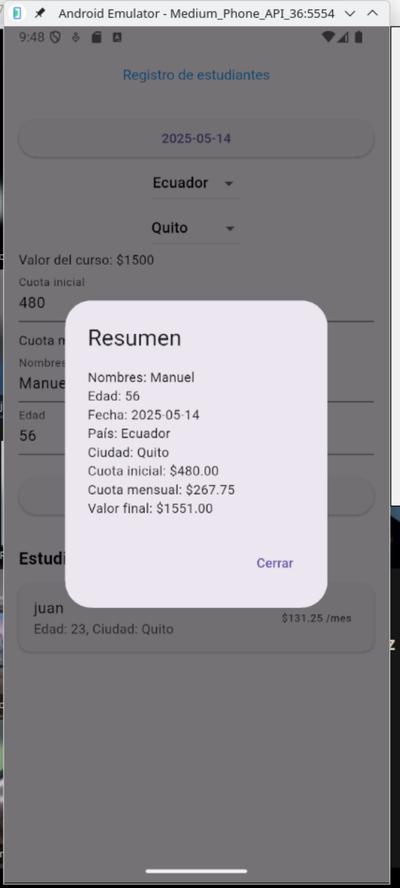
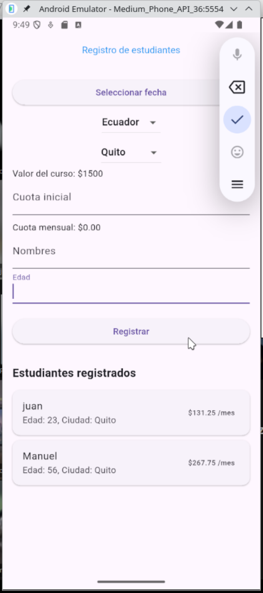

<table style="width:100%">
  <tr>
    <td style="font-size:2rem;" colspan=2>Universidad Israel</td>
    <td style="text-align:right;"></td>
  </tr>
  <tr>
    <td style="border: 1px solid black;" colspan=2>DEPARTAMENTO: Ciencias de la Ingeniería</td>
    <td style="border: 1px solid black;">PROFESOR: Humberto Guaigua</td>
  </tr>
  <tr>
    <td style="border: 1px solid black;" colspan=2>CARRERA: Informática</td>
    <td style="border: 1px solid black;">ESTUDIANTE: Edgar Castro</td>
  </tr>
  <tr>
    <td style="border: 1px solid black;" colspan=2>NIVEL: 7mo PARALELO: “A“</td>
    <td style="border: 1px solid black;">DESCRIPCIÓN: Evaluación Parcial</td>
  </tr>
  <tr>
    <td style="border: 1px solid black;" colspan=2>ASIGNATURA: Desarrollo Aplicaciones Moviles</td>
    <td style="border: 1px solid black;"></td>
  </tr>
</table>

### REPOSITORIO

https://github.com/edgarcastrovm/flutter_application_demos/tree/main/evaluacion

## EVIDENCIA EVALUACIÓN

### ingresamos usuario admin clave admin

## Pantalla inicio

## Ingresamos los datos

## Visualizamos el resumen

## Actualizamos tabla

